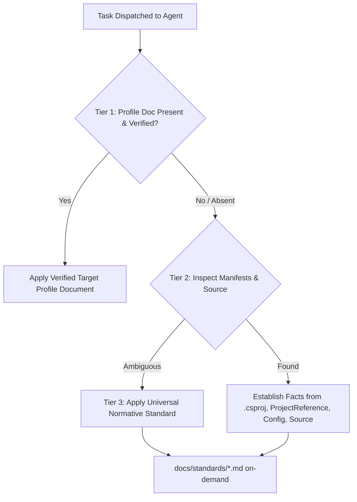

# Baseline Capability & Fallback Matrix

> **Classification:** `[CORE]`  
> **Status:** Normative Specification  
> **Authority:** Establishes feature availability and deterministic fallbacks across adoption scopes.

This matrix ensures that every engineering capability in the baseline remains fully functional whether adopted into a greenfield repository (`full-reference` scope) or merged incrementally into an existing codebase (`core-reference` scope).

---

## 1. Capability Availability Across Scopes

| Engineering Capability | Greenfield (`full-reference`) | Brownfield (`core-reference`) | Fallback When Profile Docs Are Absent |
|---|---|---|---|
| **AI Multi-Agent Orchestration** | Supported (`.kilo/agent/`) | Supported (`.kilo/agent/`) | No fallback needed; agents are core. |
| **System Analysis & Feature Specs** | Supported (`feature-spec-template.md`) | Supported (`feature-spec-template.md`) | Inlined minimal change contract. |
| **Architecture Review** | Supported (`repository-map.md` + standards) | Supported (`docs/standards/architecture-and-use-cases.md`) | Inspect solution (`.sln`), project references (`ProjectReference`), and graph summary. |
| **Feature Implementation** | Supported (`how-to-add-feature.md` + standards) | Supported (`docs/standards/architecture-and-use-cases.md`) | Discover neighboring code patterns + C# standards (`docs/standards/csharp-and-documentation.md`). |
| **API Contract Authoring** | Supported (`docs/api/` + standards) | Supported (`docs/standards/api-contracts.md`) | Inspect existing controllers, minimal API routes, and OpenAPI spec. |
| **Persistence & Migrations** | Supported (`docs/data/` + standards) | Supported (`docs/standards/persistence-and-concurrency.md`) | Inspect datastore configs and existing migration tools. |
| **Automated Testing** | Supported (`testing-guide.md` + standards) | Supported (`docs/standards/testing-and-quality.md`) | Discover test framework (`<PackageReference Include="xunit|nunit|MSTest" />`) and existing tests. |
| **Code Review Gate** | Supported (`coding-standards.md` + anti-patterns) | Supported (`docs/standards/anti-patterns.md`) | Diff inspection + language standards (`docs/standards/csharp-and-documentation.md`). |
| **Ops & Telemetry Diagnostics** | Supported (`docs/operations/` + standards) | Supported (`docs/standards/observability-and-operations.md`) | Inspect runtime configuration and telemetry dependencies. |
| **Structural Dependency Scan** | Supported (`docs/operations/graphify.md`) | Supported (`docs/operations/graphify.md`) | Solution and project dependency graph via standard dotnet CLI. |

---

## 2. Standardized 3-Tier Fallback Hierarchy

This matrix is source-only planning guidance, excluded from both destination scopes under the [canonical lifecycle](./ai-implementation-workflow.md). Permanent runtime authority is [`AGENTS.md`](../../AGENTS.md) section 2; no destination agent requires this file. Resolve project facts in that sequence:

1. **Tier 1 (Target Profile Document)**: Consult `docs/repository-profile.md` or the specific topic document (e.g. `docs/data/schema-ownership.md`) if it exists in the target.
2. **Tier 2 (Direct Manifest & Source Inspection)**: If the topic document was omitted in brownfield adoption, discover facts directly from `.csproj`, `.sln`/`.slnx`, source layouts, and compiler options.
3. **Tier 3 (Universal Standards Reference)**: Apply the normative rules from `docs/standards/<module>.md` to govern safety, invariants, transactions, and security boundaries.

**Rule**: Missing optional profile documents in `core-reference` adoption do not block work or authorize fabricated facts, extra tooling, dependencies, or scaffolding. Apply standards only to verified capabilities; report unresolved facts under `AGENTS.md` section 2.
