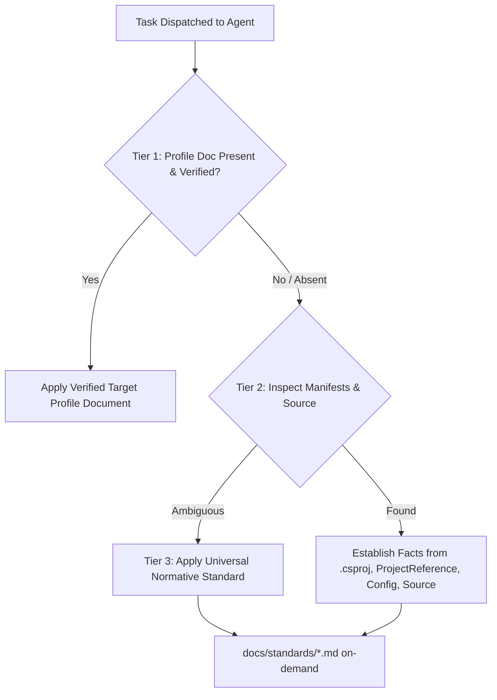

# Baseline Capability & Fallback Matrix

> **Classification:** `[CORE]`  
> **Status:** Normative Specification  
> **Authority:** Establishes feature availability and deterministic fallbacks across adoption scopes.

Both new and existing projects default to `core-reference`; `full-reference` is explicit opt-in for either. Capability parity depends on selecting coherent permanent agent/command/standard dependencies by exact-file approval, not copying directories. Optional topic files below are candidates, not guaranteed imports; use fallback whenever absent. Core blueprints remain reusable references, not automatically generated instances.

---

## 1. Capability Availability Across Scopes

| Engineering Capability | Explicit `full-reference` (when topic files selected) | Default `core-reference` (new and existing) | Fallback When Profile Docs Are Absent |
|---|---|---|---|
| **AI Multi-Agent Orchestration** | Supported (`.kilo/agent/`) | Supported (`.kilo/agent/`) | No fallback needed; agents are core. |
| **System Analysis & Feature Specs** | Supported (`feature-spec-template.md`) | Supported (`feature-spec-template.md`) | Inlined minimal change contract. |
| **Architecture Review** | Supported (`repository-map.md` + standards) | Supported (`docs/standards/architecture-and-use-cases.md`) | Inspect solution (`.sln`), project references (`ProjectReference`), and graph summary. |
| **Feature Implementation** | Supported (`how-to-add-feature.md` + standards) | Supported (`docs/standards/architecture-and-use-cases.md`) | Discover neighboring code patterns + C# standards (`docs/standards/csharp-and-documentation.md`). |
| **API Contract Authoring** | Supported (`docs/api/` + standards) | Supported (`docs/standards/api-contracts.md`) | Inspect existing controllers, minimal API routes, and OpenAPI spec. |
| **Persistence & Migrations** | Supported (`docs/data/` + standards) | Supported (`docs/standards/persistence-and-concurrency.md`) | Inspect datastore configs and existing migration tools. |
| **Automated Testing** | Supported (`testing-guide.md` + standards) | Supported (`docs/standards/testing-and-quality.md`) | Discover test framework (`<PackageReference Include="xunit|nunit|MSTest" />`) and existing tests. |
| **Code Review Gate** | Supported (`coding-standards.md` + anti-patterns) | Supported (`docs/standards/anti-patterns.md`) | Diff inspection + language standards (`docs/standards/csharp-and-documentation.md`). |
| **Ops & Telemetry Diagnostics** | Supported (`docs/operations/` + standards) | Supported (`docs/standards/observability-and-operations.md`) | Inspect runtime configuration and telemetry dependencies. |
| **Structural Dependency Scan** | Supported (`docs/operations/graphify.md`) | Supported (`docs/operations/graphify.md`) | Solution and project dependency graph via standard dotnet CLI. |

---

## 2. Optional Application Stack (Independent of Reference Scope)

These are selectable design targets, not certified adapters. All default off; both reference scopes only govern individually approved guidance imports. For approved generation, use the [greenfield profile](../architecture/net10-baseline-profile.md) and [catalog](../architecture/optional-stack-catalog.md): Core Domain/Application MediatR feature slices, modular Infrastructure provider/capability assemblies, Presentation WebApi (optional Grpc), and Unit/Integration/Architecture tests. Select actual modules and exact generated files; do not mandate one universal Infrastructure project or treat the schema as implementation evidence. Brownfield reference/capability adoption preserves runtime and architecture; migration is separate.

| Selection | Dependencies / required evidence |
|---|---|
| SQL Server / MySQL / PostgreSQL | One selected relational provider initially, or none; verify exact EF/provider/server compatibility and licenses, provider-specific migration authority, real-engine constraints/concurrency/unknown outcomes. MySQL EF10 support is a go/no-go gate, not an assumed claim. |
| MongoDB | Explicit primary-document/read-model ownership, indexes and concurrency; replica-set tests when transactions selected; additional store requires consistency/reconciliation design. |
| Elasticsearch | Derived search, not implicit authoritative storage; mappings/client-server compatibility, staleness/rebuild/outage tests; no database/search atomicity claim. |
| Redis | Optional cache with TTL/invalidation/outage bypass; not transaction authority. Cache, SignalR backplane and Hangfire storage are distinct roles. |
| RabbitMQ | Explicit routing/confirms/acks/retry/DLQ; durable publication intent/outbox and idempotent consumers where required; restart/duplicate/poison tests, not exactly-once claims. |
| gRPC | Optional separate Presentation Grpc host in approved greenfield generation; reviewed proto evolution, HTTP/2/TLS, authorization, deadlines/cancellation and message limits. Preserve verified brownfield hosting unless separately approved. |
| Hangfire | Independently selected durable storage adapter/license, authorized dashboard, retry-safe jobs and restart recovery; Redis/business database not implicit storage. |
| Sentry | One error capture owner, redaction and outage tests; optional tracing route reviewed against selected SDK. |
| Seq | One structured-log route with bounded buffering, correlation and collector outage behavior; no implied Elastic logging stack. |
| OpenTelemetry | Optional vendor-neutral instrumentation/export with one trace/metric/log ownership strategy; bounded labels, sampling, correlation and exporter failure tests; no Sentry/Seq requirement. |
| SignalR | Authenticated live transport; single-node needs no Redis; multi-node needs reviewed backplane/managed service, affinity/proxy/token policy and recovery tests. Groups are not authorization or durable storage. |
| Chat | SignalR + identity + authoritative durable history; membership/revocation, deduplicated sends, deterministic cursors, reconnect catch-up; acceptance/live delivery/read are distinct. |
| Notification inbox | Identity + authoritative store; recipient ownership, stable deduplication, unread/read-state and preference tests. SignalR hints and external push are independent. |
| Web push | Explicit FCM or reviewed Web Push/VAPID/managed provider; consent, HTTPS/service-worker prerequisites, destination ownership/rotation, SSRF-safe outbound policy and payload privacy. |
| Mobile push | Explicit FCM/APNs or reviewed native/managed route; device/account lifecycle, consent and platform limits. Provider acceptance is not device delivery/read. |
| External-push dispatch | Durable intent/attempt storage and bounded retries/expiry/invalid-destination cleanup; inbox/chat/SignalR not required; RabbitMQ/Hangfire optional. Live device/provider tests require separate permission. |

Record exact versions, date, license/support evidence and `proposed | verified | unavailable | deferred` status per selected capability; passing restore/build alone is not integration certification. Unselected modules add no packages, schema, containers, required options, hosted services, health probes or network calls. Cover each adapter and critical dependency pairs rather than every possible combination.

`examples/**`, including `examples/Baseline.Sample`, is excluded from both reference payloads. Its isolated in-memory core example does not certify these integrations; separately approved generation may consult a blueprint, never recursively copy source. Browser service workers, mobile projects, Firebase accounts, APNs keys and live sends are not implicit backend adoption artifacts.

## 3. Standardized 3-Tier Fallback Hierarchy

This matrix is source-only planning guidance, excluded from both destination scopes under the [canonical lifecycle](./ai-implementation-workflow.md). Permanent runtime authority is [`AGENTS.md`](../../AGENTS.md) section 2; no destination agent requires this file. Resolve project facts in that sequence:

1. **Tier 1 (Target Profile Document)**: Consult `docs/repository-profile.md` or the specific topic document (e.g. `docs/data/schema-ownership.md`) if it exists in the target.
2. **Tier 2 (Direct Manifest & Source Inspection)**: If the topic document was omitted in brownfield adoption, discover facts directly from `.csproj`, `.sln`/`.slnx`, source layouts, and compiler options.
3. **Tier 3 (Universal Standards Reference)**: Apply the normative rules from `docs/standards/<module>.md` to govern safety, invariants, transactions, and security boundaries.

**Rule**: Missing optional profile documents in `core-reference` adoption do not block work or authorize fabricated facts, extra tooling, dependencies, or scaffolding. Apply standards only to verified capabilities; report unresolved facts under `AGENTS.md` section 2.
