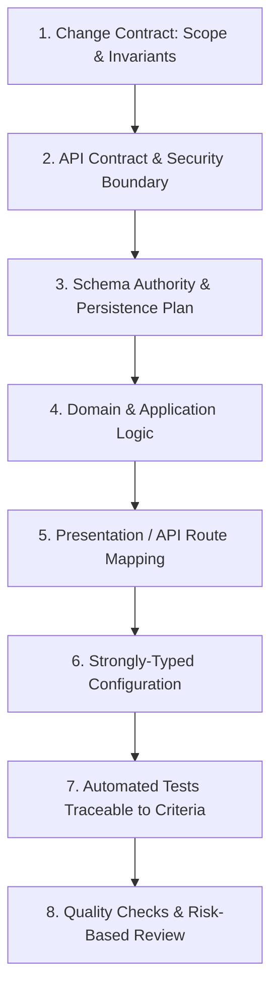

# Change Delivery Contract & Alignment Governance

> **Classification:** `[CORE]`  
> **Status:** Normative Standard  
> **Authority:** Coordinates implementation across Business Features, API Contracts, Database Persistence, Configuration, and Tests.

When implementing changes in this repository, software engineers and AI agents MUST adhere to this coordinated change delivery sequence to ensure that API models, domain logic, persistence schemas, runtime settings, and test cases remain synchronized.

---

## 1. Applicability & Threshold

- **Straightforward Changes**: Use a concise inline change contract (objective, scope/affected files, invariants, acceptance criteria, and test strategy), including when multiple concerns are touched. Concern count alone does not require a separate specification or specialist review.
- **Higher-Risk or Ambiguous Changes**: Use a separate specification, such as [`docs/collaboration/feature-spec-template.md`](../collaboration/feature-spec-template.md), and targeted specialist review when concrete risk, ambiguity, or coordination needs justify them. Examples include authorization/tenancy changes, breaking public contracts, irreversible data changes, financial/concurrency invariants, or unclear ownership. Resolve consequential decisions before implementation.
- Apply only relevant steps below, proportionate to risk. Approved new targets default to .NET 10 Core Domain/Application MediatR CQRS feature slices, modular Infrastructure provider/capability assemblies, Presentation WebApi controllers (optional Grpc), and Unit/Integration/Architecture test projects. Selected hosts own composition-root wiring; avoid speculative repositories, interfaces or custom mediator frameworks. Brownfield reference adoption preserves verified runtime, layers, dispatcher and transport; migrations/capability additions need separate approval. Use the permanent fallback in [`AGENTS.md`](../../AGENTS.md#3-scope--change-safety) when profiles are incomplete.
- Distinguish reference guidance, the isolated [memory-only sample](../../examples/Baseline.Sample/README.md), and consuming-target implementation. No example establishes vendor SDK compatibility, production readiness, or permission to generate a target.
- Flexibility never waives security checks, execution permissions, compatibility, schema authority, transaction integrity, or meaningful verification.

---

## 2. Coordinated Implementation Sequence

### Step 1: Change Contract Definition
- Define Goals, explicit Non-Goals, and authorized scope.
- Identify the authenticated actor, tenant context, and authorization policies.
- Record selected and omitted [optional capabilities](../architecture/optional-stack-catalog.md), dependent storage/hosts, exact compatibility/license evidence and deferred checks. Chat, SignalR, persistent inbox, and external push are separate selections; no implicit Redis, Firebase, RabbitMQ, or Hangfire dependency.

### Step 2: API Contract & Security Boundary
- Confirm HTTP method, URI route, request DTO, and response status codes.
- Ensure error shapes adhere to [`docs/standards/api-contracts.md`](../standards/api-contracts.md) and [`docs/api/response-and-error-contracts.md`](../api/response-and-error-contracts.md).
- Prevent mass assignment and SSRF by explicitly modeling request contracts.

### Step 3: Schema Authority & Persistence Strategy
- Determine schema ownership via [`docs/data/schema-ownership.md`](../data/schema-ownership.md).
- If database modifications are needed, apply the Expand-Migrate-Contract pattern ([`docs/standards/persistence-and-concurrency.md`](../standards/persistence-and-concurrency.md#91-schema-authority-profiles)).
- Define concurrency control where state invariants require it. Select durable idempotency/deduplication only when repeat effects are unacceptable; document key scope, retention, payload mismatch and replay behavior rather than mandating storage for every request.
- Define confirmed commit, confirmed rollback and unknown-outcome behavior before retrying. Required cross-store publication needs durable recovery, not an assumed distributed transaction. Chat history/inbox durability must use authoritative storage, not SignalR connections or push acceptance.

### Step 4: Domain & Application Business Logic
- Implement invariants and state transitions at the verified business/persistence boundary. Use Domain/Core entities and Application use-case handlers only where the architecture selects them.
- When application handlers are selected, keep transport-specific envelopes (e.g. `IActionResult`) outside them. Simple CRUD may use the existing minimal structure without new abstractions.
- Propagate `CancellationToken` through all asynchronous I/O methods. Never block with `.Result` or `.Wait()`.

### Step 5: Presentation / API Route Mapping
- In new targets, Presentation WebApi controllers dispatch Core Application requests through MediatR and map results to HTTP contracts; optional Grpc follows the same use-case boundary. Selected Infrastructure provider/capability references are for host composition-root registration only. In existing targets, map endpoints through verified boundaries without adding handlers solely for routing.
- Handle input validation and serialize response payloads matching published contracts.

### Step 6: Configuration & Secrets
- When configuration changes, follow verified configuration conventions and use strongly typed options where appropriate; do not create a new application layer for configuration.
- Never store production credentials or API keys in `appsettings.json`. Use environment variables or secret stores.
- Document actual target keys consistently across options, local setup and deployment; illustrative keys are not universal defaults. Omitted modules must have no required settings, services, packages, containers, probes, or network calls. Readiness reflects required endpoint dependencies, not every optional exporter/cache.

### Step 7: Automated Testing
- Implement tests directly traceable to acceptance criteria in the inline change contract or justified specification; use Given / When / Then when helpful.
- Exercise happy paths, validation failures, concurrency conflicts, and authorization denial where applicable. Include selected-adapter outage/recovery and omitted-capability absence checks using the [testing matrix](./testing-guide.md).
- Verify framework, runner, target manifests and CLI arguments before claiming test commands; preserve existing runner choices. Mocked/memory-only success is not external-provider certification.
- Follow test determinism rules in [`docs/standards/testing-and-quality.md`](../standards/testing-and-quality.md#153-determinism).

### Step 8: Quality Gates
- Review the diff against applicable [`docs/standards/anti-patterns.md`](../standards/anti-patterns.md). Use `code-reviewer` for targeted independent review when concrete risk or coordination warrants it, not automatically for every change.
- Use `architect-reviewer` when boundary or public contract changes introduce architectural risk or unresolved decisions. Preserve required repository/security review gates.
- Synchronize affected documentation and inspect touched C# XML documentation per [`docs/standards/csharp-and-documentation.md`](../standards/csharp-and-documentation.md#14-c-and-documentation-standards) before completion.

---

## 3. Coherence & Consistency Checklist

Before declaring any change complete, verify applicable items and explain exclusions:
- [ ] **DTO-to-Domain Fidelity**: Domain invariants are enforced; DTOs do not expose entity internals.
- [ ] **Type Precision**: Monetary or high-precision values use appropriate numeric types across API, Domain, and Database representations.
- [ ] **Error Code Alignment**: API error codes match documented stable codes in `docs/api/response-and-error-contracts.md`.
- [ ] **Cancellation Propagation**: All async database, HTTP, and disk calls propagate `CancellationToken`.
- [ ] **Zero Committed Secrets**: Settings files contain empty placeholders for secrets.
- [ ] **Meaningful Verification**: Execute discovered authorized checks with meaningful assertions; report exact outcomes, unexecuted checks with reasons, and residual risks. Never claim unexecuted checks passed.
- [ ] **Documentation Coherence**: Update affected maintained API/configuration/operations/schema/developer documentation in the same change, or report no impact/blockers per the canonical documentation standard.
- [ ] **Touched XML Coverage**: Inspect touched handwritten classes, actions/named endpoint handlers, properties, and fields for concise XML docs; honor generated/vendor and untouched-legacy exclusions.
- [ ] **Proportionate Design & Process**: No speculative abstractions or unnecessary layers/specifications; risk-based decisions preserve all safety and permission gates.
